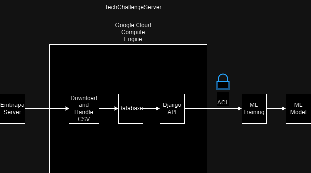

# TechChallenge 01

Este projeto tem como objetivo:

- Criação de API que retorne dados do site referente a vinicultura da EMBRAPA.
- A API deverá alimentar uma base de dados que será utilizada futuramente para um modelo de ML.

# Getting Started

Chamar o método GET '/api/buscar-dados-embrapa-e-criar-update/' para que os arquivos sejam baixados.

# Arquitetura

Abaixo está o diagrama com a arquitetura proposta para o Deploy da API

# MVP

http://34.31.123.18:8000/api/docs/

